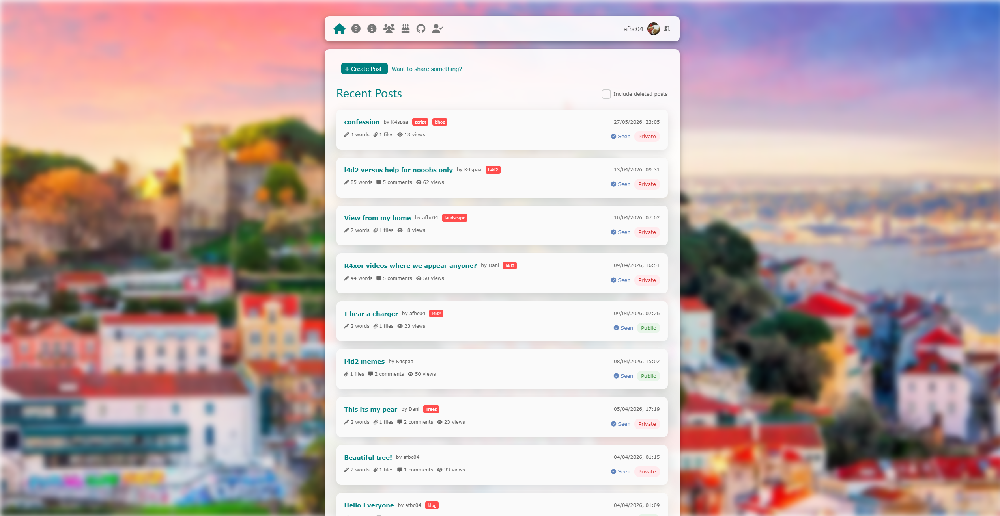
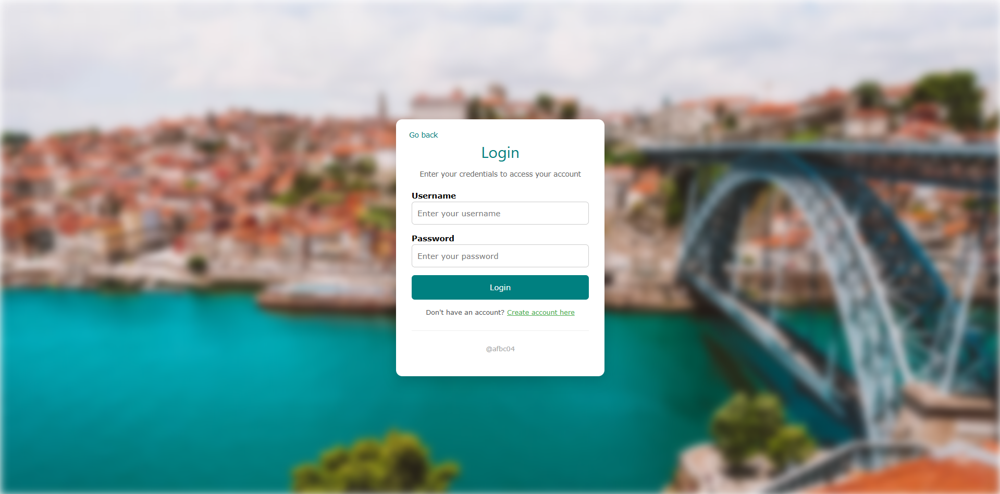
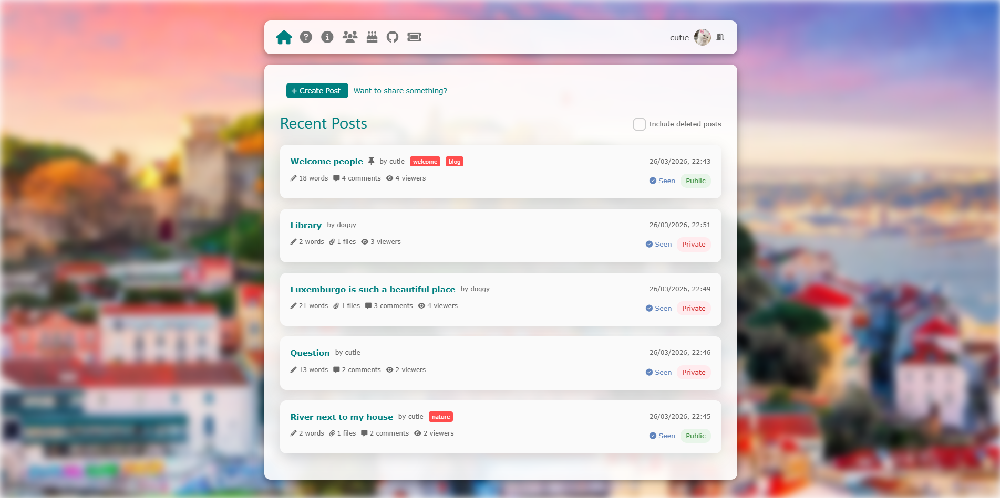
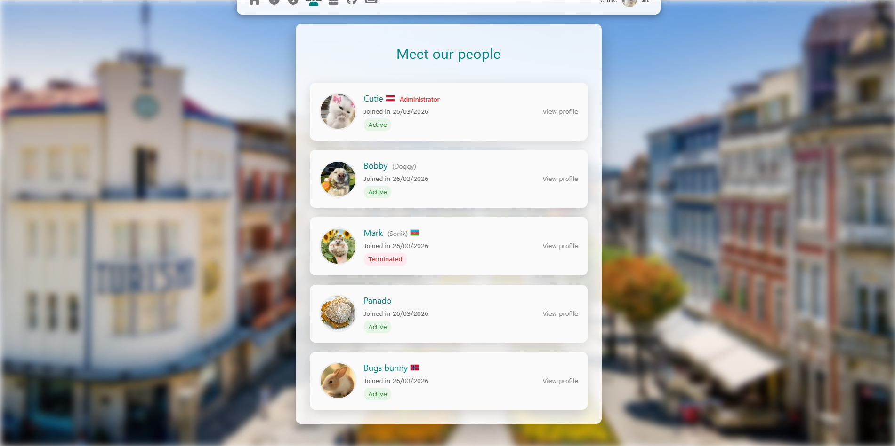
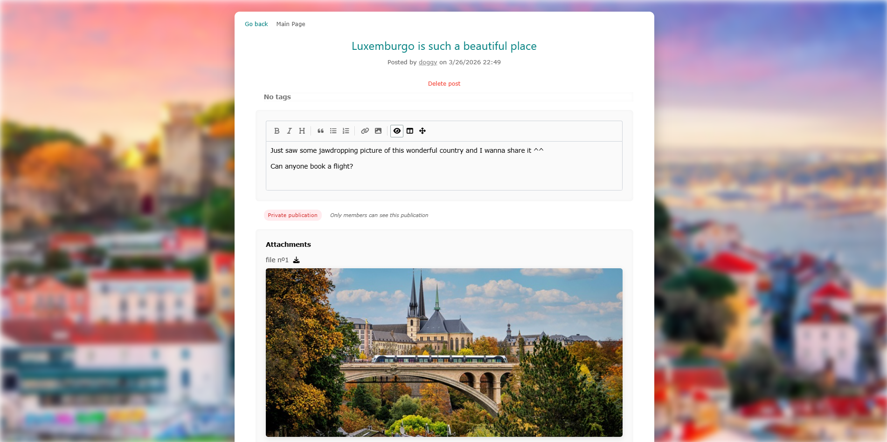
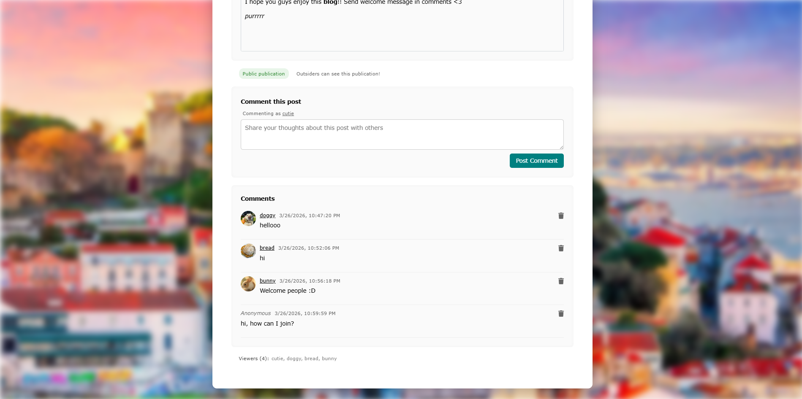
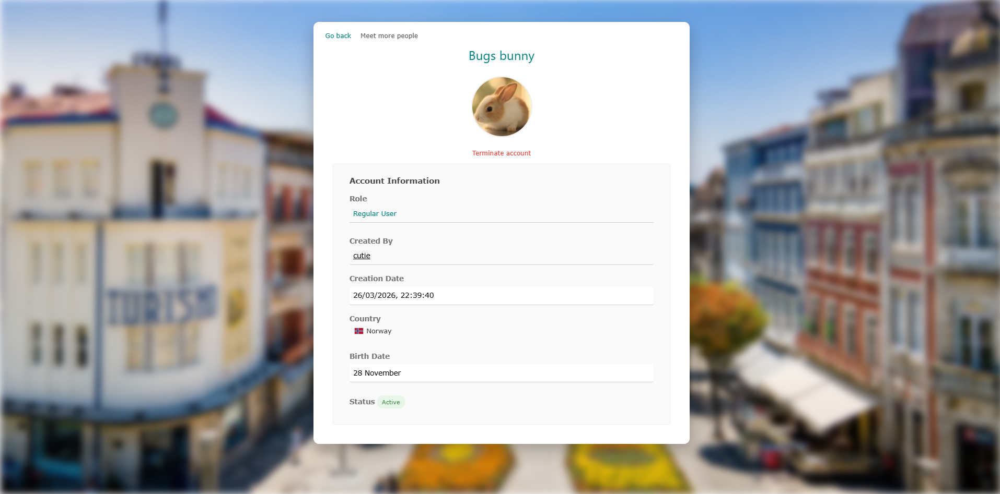

# Farewell L4D2 Blog

This blog is currently offline. Was good while it was alive :D  
Huge thanks to `L4D2 University` steam group chat that helped and used this blog, making it a special place.  
Special thanks to:
- Dani
- Blebi
- Kaspadzitas
- Scream

**Beginning of Blog** 04/04/2026  
**Closure of Blog:** 28/05/2026  
**Users Registered:** 5  
**Blog Posts:**  10  
**Domain of Blog:** https://blog.afbc04.com

_Backup of blog is saved, in case it's open again :)_

### Last view of Blog


# Deploy

### Install

    git clone git@github.com:afbc04/l4d2-blog.git

    cd l4d2-blog/

### Configurate app

1.     touch .env   #Create environment variables file

2. Write these variables in **.env** file

```.env
JWT_SECRET=
JWT_SECRET_REGISTRATION_TOKEN=
MONGO_USER=
MONGO_PASS=
MONGO_DB=
```

Example:

```.env
JWT_SECRET=jwtsecret
JWT_SECRET_REGISTRATION_TOKEN=jwtsecretrt
MONGO_USER=admin
MONGO_PASS=password
MONGO_DB=database
```

# Start project

### Install - Docker Compose

    docker compose up --build    # If it's your first time installing

    docker compose up            # If you already installed docker

#### Application URL

Application will be running at:

    http://localhost:3000
_Edit docker compose file if you want to change port_

# Useful commands

### See database

    docker exec -it <container_id> bash
    mongosh -u <username> -p <password>
    use <database_name>

# Preview

### Login Page



### Main Page



### Users Page



### Post Page



### Post Comments



### User Profile



# Testing resources

This project provides a directory with testing resources to test the project.  
Those resources are located in [experimental-data/](experimental-data/)

All users password is **"s"**

### Import into Database

    docker cp experimental-data/database/*.json <container_id_database>:/<destination_path>

    mongoimport --db <database_name> --collection counters --file <destination_path>/counters.json --jsonArray
    mongoimport --db <database_name> --collection users --file <destination_path>/users.json --jsonArray
    mongoimport --db <database_name> --collection posts --file <destination_path>/posts.json --jsonArray

### Import into FileSystem

    docker cp experimental-data/uploads/ <container_id_api>:/usr/src/app/uploads/

# Funcionalities

### Auth Endpoints

| Endpoint | Functionality | Description | Authentication | Notes |
|----------|---------------|-------------|----------------|----------------|
| GET /auth/login | Render login page | Displays the login form, optionally showing success if `username` is provided in query | No | |
| POST /auth/login | Login user | Tries to authenticates using `username` and `password`, creating JWT & storing in cookie | No | |
| GET /auth/logout | Logout user | Clears auth token from cookie | No (token optional) | |

---

### Index Endpoints

| Endpoint | Functionality | Description | Authentication | Notes |
|----------|---------------|-------------|----------------|----------------|
| GET / | Main page | Lists posts | Optional | private posts are only visible to authenticated accounts |
| GET /info | Information page | Shows general information | Optional |  |
| GET /about | About page | Shows about page | Optional |  |
| GET /birthdays | Birthday page | Shows upcoming birthdays for active users | Required |  |


### Posts Endpoints

| Endpoint | Functionality | Description | Authentication | Notes |
|----------|---------------|-------------|----------------|----------------|
| GET /posts/create | Render create post form | Shows form for creating post | Required | |
| POST /posts/create | Create new post | Saves post & uploads attachments | Required | |
| GET /posts/view/:post | View post | Shows post details, comments, viewers | Optional | Comments & private posts are blocked from non-registered users |
| GET /posts/edit/:post | Edit post form | Shows form to edit post | Required (Only post author) |  |
| POST /posts/edit/:post | Edit post | Updates post metadata | Required (Only post author) |  |
| GET /posts/delete/:id | Delete post confirmation | Shows confirmation page | Required (Admins or post author) | |
| POST /posts/delete/:id | Delete post | Marks post as deleted, clears content, removes files | Required (Admins or post author)  | Comments, content & files are deleted from system |
| POST /posts/comments/:post | Add comment | Adds a comment to a post | Optional | If user is not registered, comment has no user associated with it |
| POST /posts/deleteComment/:post/:comment | Delete comment | Deletes a comment | Required (Post author & comment author) | |

### Users Endpoints

| Endpoint | Functionality | Description | Authentication | Notes |
|----------|---------------|-------------|----------------|----------------|
| GET /users | List users | Shows all users with countries | Required |  |
| GET /users/create | Create user form | Shows registration form, requires token if not first user | No | |
| POST /users/create | Create user | Validates token, creates new user, uploads profile picture | No | If its the first user of system, no need of registration token |
| GET /users/details/:username | View user | Displays user profile with birthdate, age, country | Required | |
| GET /users/edit/:id | Edit user form | Shows form to edit own account | Required (self) | |
| POST /users/edit/:id | Edit user | Updates user info and optionally profile picture | Required (self) | |
| GET /users/delete/:id | Delete user form | Shows delete confirmation page | Required (admin or self) | |
| POST /users/delete/:id | Delete user | Marks user inactive, records deletion reason | Required (admin or self) |  |
| GET /users/change-password/:id | Change password form | Shows form to change password | Required (admin or self) | |
| POST /users/change-password/:id | Change password | Updates user password | Required (admin or self) |  |
| GET /users/get-registration-token | Generate registration token | Admin generates a registration token for new users | Required (admin) | |

### Files Endpoints

| Endpoint | Functionality | Description | Authentication | Possible Flows |
|----------|---------------|-------------|----------------|----------------|
| GET /files/:id/* | Send files | Returns uploaded files for a post | Optional | If post is deleted, no file is provided. If post is private, file only served if user is authenticated |

### Images Endpoints

| Endpoint | Functionality | Description | Authentication | Possible Flows |
|----------|---------------|-------------|----------------|----------------|
| GET /images/profilePicture/:file | Send profile picture | Returns a user's profile picture | Required | |

# Documentation

This project uses **Express.js** with Node.js, organized around five main components:

- **Model** – Defines the structure of entities in the database.
- **Controller** – Implements methods to interact with the database.
- **View** – Defines HTML templates using **Pug**, rendering pages with the data provided by controllers.
- **Authenticator** – Provides and validates **JWT tokens** for secure authentication and authorization.
- **Routes** – Exposes the application functionality and connects the router to controllers, views, and authenticator.

### Flow of Functionalities

1. The user accesses a feature via **routes** (URLs/endpoints).
2. The **router** checks with the **authenticator**, if required, to verify whether the action is allowed.
3. The **router** calls the appropriate **controller** to fetch or modify data in the database.
4. The **controller** uses the **model** to understand the structure and properties of entities it handles.
5. The **router** gathers the necessary information from the controller and provides it to the **view**.
6. The **view** renders a static HTML page with all content fully prepared.
7. The **router** sends the rendered page or response back to the user.

# Project Structure

- **auth/**
  - [auth.js](auth/auth.js) — _Creation & validation of authentication tokens_
  - [registrationToken.js](auth/registrationToken.js) — _Creation & validation of registration tokens_

- **bin/**
  - [www](bin/www) — _Configuration file of project_

- **controllers/**
  - [post.js](controllers/post.js) — _Manages posts & its comments in database_
  - [user.js](controllers/user.js) — _Manages user accounts_

- **logs/** — _Stores logs_

- **models/**
  - [post.js](models/post.js) — _Defines Posts structure in database_
  - [user.js](models/user.js) — _Defines Users structure in database_

- **public/**
  - **images/** — _Directory containing all public static images_
  - **stylesheets/** — _Directory containing all public static stylesheets_

- **routes/**
  - [auth.js](routes/auth.js) — _Defines methods related to authentication_
  - [files.js](routes/files.js) — _Defines methods that serves files through URL_
  - [images.js](routes/images.js) — _Defines methods that serves images through URL_
  - [index.js](routes/index.js) — _Defines methods related to main page, such as listing of posts, birthdays, about & info_
  - [posts.js](routes/posts.js) — _Defines methods related to posts & commenting_
  - [users.js](routes/users.js) — _Defines methods related to users & creation of users_

- **uploads/**
  - **files/** — _Directory containing files of posts_
  - **profile_pictures/** — _Directory containing custom profile pictures of users_

- **utils/**
  - [logger.js](utils/logger.js) — _Defines & improves logger_
  - [sequence.js](utils/sequence.js) — _Manages sequence counter in database_

- **views/**
  - **auth/**
    - [login.pug](views/auth/login.pug) — _Login Page_
    - [tooManyAttempts.pug](views/auth/tooManyAttempts.pug) — _Page to inform user did too many attempts to login_

  - **index/**
    - [about.pug](views/index/about.pug) — _About Page_
    - [birthdays.pug](views/index/birthdays.pug) — _Birthdays Page_
    - [info.pug](views/index/info.pug) — _Informations Page_
    - [listPost.pug](views/index/listPost.pug) — _Main Page, containing lists of posts_

  - **posts/**
    - [createPost.pug](views/posts/createPost.pug) — _Create Post Page_
    - [deletePost.pug](views/posts/deletePost.pug) — _Delete Post Page_
    - [editForbiddenPost.pug](views/posts/editForbiddenPost.pug) — _Page informing post cannot be edited_
    - [editPost.pug](views/posts/editPost.pug) — _Edit Post Page_
    - [noPostFound.pug](views/posts/noPostFound.pug) — _Page informing post does not exists_
    - [viewDeletedPost.pug](views/posts/viewDeletedPost.pug) — _Page informing and explaining why post was deleted_
    - [viewPost.pug](views/posts/viewPost.pug) — _View Post Page_
    - [viewPrivatePost.pug](views/posts/viewPrivatePost.pug) — _Page informing post cannot be seen because it's private and user is not authenticated_

  - **users/**
    - [changePassword.pug](views/users/changePassword.pug) — _Changing Password of User Page_
    - [createUser.pug](views/users/createUser.pug) — _Create User Page_
    - [deleteUser.pug](views/users/deleteUser.pug) — _Terminate User Page_
    - [editUser.pug](views/users/editUser.pug) — _Edit User Page_
    - [getRegistrationToken.pug](views/users/getRegistrationToken.pug) — _Page providing a registration token_
    - [listUsers.pug](views/users/listUsers.pug) — _Page listing all the existing users_
    - [noUserFound.pug](views/users/noUserFound.pug) — _Page informing user does not exists_
    - [viewUser.pug](views/users/viewUser.pug) — _View User details Page_

  - [error.pug](views/error.pug) — _Internal Server Error Page_
  - [forbidden.pug](views/forbidden.pug) — _Page informing the user has not permission to access certain functionality_
  - [layout.pug](views/layout.pug) — _Layout Page, base of all pages & importing dependencies_
  - [notfound.pug](views/notfound.pug) — _Not Found Page_

- [.gitignore](.gitignore) — _Avoid adding storage & compiled binaries_
- [Dockerfile](Dockerfile) — _dockerfile to load expressJS into a container_
- [README.md](README.md) — _Documentation of project_
- [app.js](app.js) — _Entry Point of server with expressJS_
- [docker-compose.yml](docker-compose.yml) — _Docker compose to assist with building and management of containers required to this project_
- [package.json](package.json) — _List of required dependencies_

# Tools

This project uses the following technologies:

| Technology | Why Use It | References |
|------------|---------------|------------|
| **Node.js** | Provides a fast, event-driven, non-blocking runtime for JavaScript on the server. Enables full-stack JavaScript development. | [Node.js Official](https://nodejs.org/) |
| **Express.js** | Lightweight web framework for Node.js that simplifies routing, middleware, and REST API creation. | [Express.js Official](https://expressjs.com/) |
| **MongoDB** | Flexible, schema-less NoSQL database, ideal for storing JSON-like documents, scaling horizontally and fast development. | [MongoDB Official](https://www.mongodb.com/) |
| **Pug** | Template engine for rendering dynamic HTML on the server, with concise syntax and support for includes, mixins, and logic. | [Pug Official](https://pugjs.org/) |
| **JWT (JSON Web Tokens)** | Enables secure, stateless authentication by encoding user information and roles into tokens. | [JWT.io](https://jwt.io/) |
| **Passport-local** | Strategy for Passport.js that allows authentication using a username and password. Simplifies user login handling and integrates easily with Express. | [Passport-local](http://www.passportjs.org/packages/passport-local/) |
| **Multer** | Handles file uploads easily within Express routes, supporting single/multiple files and custom storage. | [Multer GitHub](https://github.com/expressjs/multer) |
| **Docker** | Containerizes the application for consistent environments across development, testing, and production. | [Docker Official](https://www.docker.com/) |
| **Docker Compose** | Simplifies running multi-container setups (e.g., Node.js + MongoDB) using a single configuration file. | [Docker Compose Official](https://docs.docker.com/compose/) |
